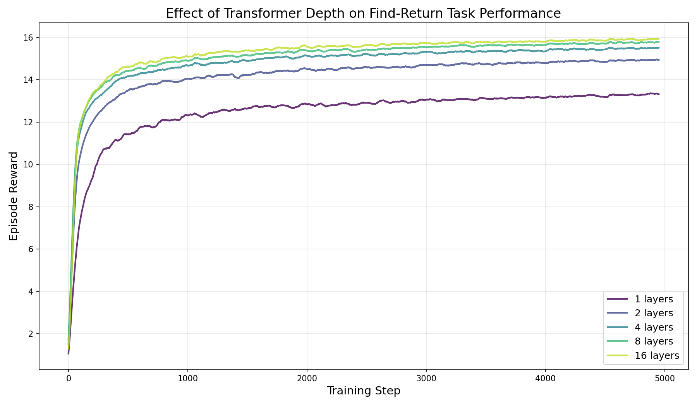
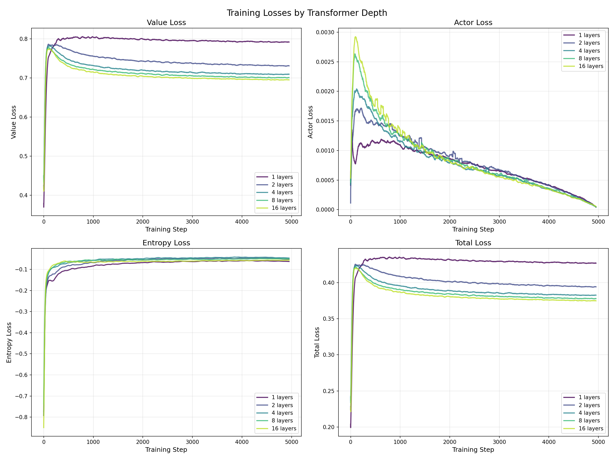
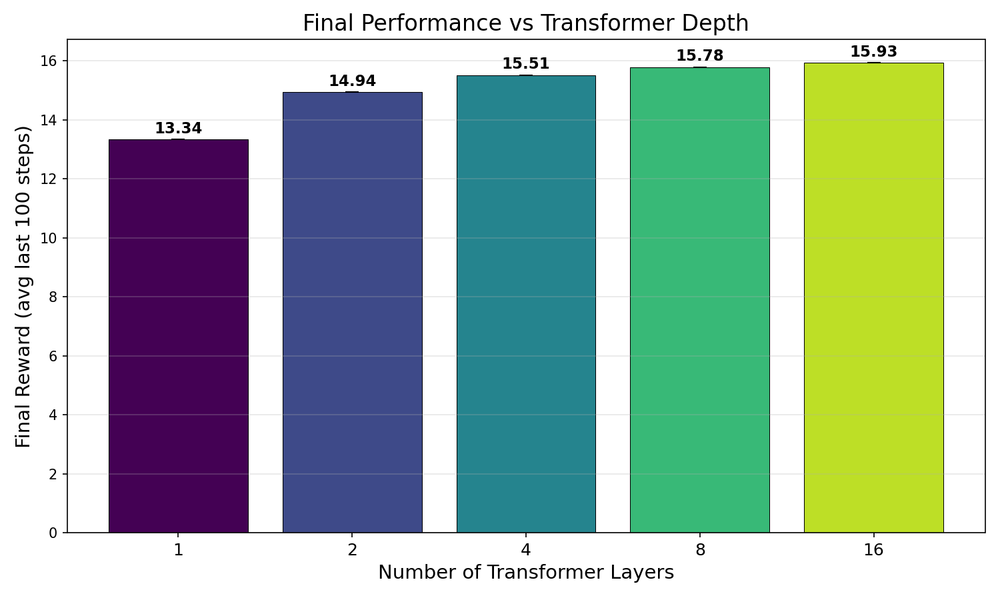

# Transformer Depth Experiment Report
## Find-Return Navigation Task

### Thesis

> Model depth (number of transformer layers) shows diminishing returns for the
> find_return navigation task. Moderate depth (4-8 layers) achieves comparable
> performance to 16 layers, while very shallow models (1-2 layers) significantly
> underperform.

### Experiment Setup

- **Environment**: find_return (40x40 grid, 8 agents, 11x11 view)
- **Training**: PPO with Muon optimizer, 5000 update steps
- **Seed**: 42 (fixed for reproducibility)
- **Layer counts tested**: 1, 2, 4, 8, 16
- **All other hyperparameters**: held constant from return.json baseline

### Key Findings

1. **Best performing depth**: 16 layers (final reward: 15.93)
2. **Worst performing depth**: 1 layers (final reward: 13.34)
3. **Performance spread**: 2.59 reward difference

### Performance by Depth

- **1 layers**: 13.34 reward (83.7% of best)
- **2 layers**: 14.94 reward (93.8% of best)
- **4 layers**: 15.51 reward (97.4% of best)
- **8 layers**: 15.78 reward (99.1% of best)
- **16 layers**: 15.93 reward (100.0% of best)

### Plots

